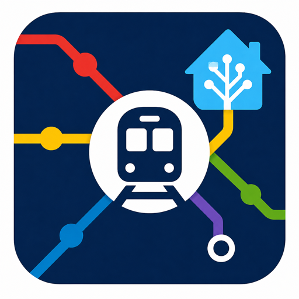

# Adelaide Metro Realtime

A HACS-compatible Home Assistant custom integration for Adelaide Metro realtime public transport data.

## Features

### Route-based configuration
- Configure by **route ID** (e.g. `SEAFRD`, `GLNELG`) — the integration discovers all stops automatically
- Optionally filter to specific stop IDs if you only want a subset

### Realtime departures
- Stop-based realtime departure monitoring using Adelaide Metro GTFS Realtime Trip Updates
- Per-stop sensors:
  - **Next departure** — minutes until the next service, suitable for dashboards and automations
  - **Upcoming departures** — count of upcoming services in the next period
- Direction-aware naming using trip headsigns
  - Example: `Seaford Meadows Railway Station (City-bound)`
  - Example: `Seaford Meadows Railway Station (Seaford-bound)`

### Vehicle tracking
- Realtime vehicle positions via GTFS-RT Vehicle Positions feed
- **Device trackers** — vehicles appear automatically on every Home Assistant map
- Per-vehicle sensor entities with detailed attributes (speed, bearing, wheelchair, aircon)
- Vehicle entities appear and disappear automatically as vehicles start and end trips
- Filtered to vehicles on your configured routes

### Static GTFS enrichment
- Pulls the latest Adelaide Metro static GTFS bundle on startup (and periodically thereafter)
- Enriches entities with stop names, stop codes, coordinates, route names and trip headsigns from:
  - `stops.txt`
  - `routes.txt`
  - `trips.txt`
  - `stop_times.txt`

### Service alerts
- Polls Adelaide Metro GTFS Realtime Service Alerts
- Provides:
  - a **Service Alerts summary sensor** showing total active alert count
  - **separate alert entities** for alerts relevant to configured stops/routes only
- Alert entities are exposed to Home Assistant Assist by default
- Configurable grace period before cleared alerts are removed (default 30 min)

### Refresh service
- `adelaide_metro.refresh` — force-refresh all data via automations or scripts

## Installation

### HACS (recommended)
1. In HACS, go to **Integrations → Custom repositories**
2. Add `https://github.com/Anquietas86/ha-adelaide-metro` as an **Integration**
3. Install **Adelaide Metro Realtime**
4. Restart Home Assistant
5. Go to **Settings → Devices & Services → Add Integration**
6. Search for **Adelaide Metro Realtime**

### Manual
Copy `custom_components/adelaide_metro/` to your Home Assistant `config/custom_components/` directory and restart.

## Configuration

During setup you will be asked for:

| Field | Description | Default |
|-------|-------------|---------|
| Route IDs | Comma separated route IDs to monitor (e.g. `SEAFRD,GLNELG`) | required |
| Stop IDs | Comma separated stop IDs to filter (optional — leave blank for all stops on route) | none |
| Maximum departures | Max upcoming services to track per stop | 5 |
| Refresh interval | Seconds between realtime data refreshes | 60 |
| Expose to assistants | Auto-expose entities to Assist and Google Assistant | on |
| Static GTFS refresh | Hours between static data refreshes | 24 |
| Alert grace period | Minutes before cleared alerts are removed | 30 |

All settings can be edited after setup via **Settings → Devices & Services → Adelaide Metro Realtime → Configure**.

## Finding route IDs

Route IDs are short codes from the Adelaide Metro static GTFS feed. Some examples:

| Route | Route ID |
|-------|----------|
| Seaford line | SEAFRD |
| Flinders line | FLNDRS |
| Belair line | BELAIR |
| Gawler line | GAWL |
| Outer Harbor line | OUTHA |
| Grange line | GRNG |
| Glenelg tram | GLNELG |
| O-Bahn (city) | OBAHN |

To find route IDs for other services, download the latest static GTFS from `https://gtfs.adelaidemetro.com.au/v1/static/latest/google_transit.zip` and check `routes.txt`.

## Finding stop IDs (optional)

Stop IDs are numeric identifiers. You only need these if you want to limit which stops are tracked — otherwise the integration auto-discovers all stops on your selected routes.

To find specific stop IDs:
- Download the latest static GTFS from `https://gtfs.adelaidemetro.com.au/v1/static/latest/google_transit.zip`
- Open `stops.txt` and search for your station

For stations with multiple platforms/directions, add the individual stop IDs per platform.

## Entity types

### Per configured stop
- `Next departure` — minutes until next service
- `Upcoming departures` — count of next services

### Per vehicle
- `device_tracker.*` — GPS position on all maps (auto-discovered)
- Vehicle sensor — detailed attributes (speed, bearing, accessibility)

### Per integration (Service Alerts device)
- `Service alerts` — total active alert count in the network feed
- One entity per relevant active alert

## Data sources

| Feed | URL |
|------|-----|
| Trip updates | `https://gtfs.adelaidemetro.com.au/v1/realtime/trip_updates` |
| Service alerts | `https://gtfs.adelaidemetro.com.au/v1/realtime/service_alerts` |
| Vehicle positions | `https://gtfs.adelaidemetro.com.au/v1/realtime/vehicle_positions` |
| Static GTFS | `https://gtfs.adelaidemetro.com.au/v1/static/latest/google_transit.zip` |
| Proto definition | `https://gtfs.adelaidemetro.com.au/v1/realtime/adelaidemetro_gtfsr.proto` |

## Adelaide Metro custom proto extension

Adelaide Metro uses a custom protobuf extension on `VehicleDescriptor` (extension id `1999`, namespace `transit_realtime.tfnsw_vehicle_descriptor`) with fields:
- `air_conditioned` (default true)
- `wheelchair_accessible` (int32, 0 or 1)

These are exposed as entity attributes on vehicle sensors and device trackers.

## Contributing

Pull requests welcome. See [CONTRIBUTING.md](CONTRIBUTING.md) if present.

## License

MIT
