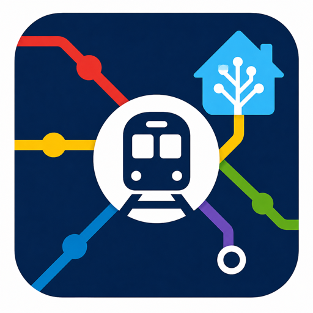

# Adelaide Metro Realtime

A HACS-compatible Home Assistant custom integration for Adelaide Metro realtime public transport data.

## Features

### Route-based configuration
- Pick your routes from a searchable list, then pick the stops you care about (shown with their direction)
- Leave stops empty to monitor every stop on your routes, up to 40 stops

### Realtime departures
- Stop-based realtime departure monitoring using Adelaide Metro GTFS Realtime Trip Updates
- Gaps in the live feed are filled from the published timetable; each departure says whether it is `realtime` or scheduled
- Per-stop sensors:
  - **Next departure** — minutes until the next service, with delay, scheduled time and live/timetable attributes
  - **Next departure time** — the same departure as a timestamp, so dashboards show a live countdown
  - **Upcoming departures** — count of upcoming services in the next period
- Cancelled and skipped services are listed in a `cancellations` attribute instead of showing as departures
- Direction-aware naming using trip headsigns
  - Example: `Seaford Meadows Railway Station (City-bound)`
  - Example: `Seaford Meadows Railway Station (Seaford-bound)`

### Vehicle tracking
- Realtime vehicle positions via GTFS-RT Vehicle Positions feed
- **Device trackers** — vehicles appear automatically on every Home Assistant map
- Per-vehicle sensor entities with detailed attributes (speed, bearing, wheelchair, aircon)
- Vehicle entities appear and disappear automatically as vehicles start and end trips
- Filtered to vehicles on your configured routes

### Static GTFS enrichment
- Downloads the Adelaide Metro static GTFS bundle, caches it on disk, and only re-downloads when it has changed
- Enriches entities with stop names, stop codes, coordinates, route names and trip headsigns from:
  - `stops.txt`
  - `routes.txt`
  - `trips.txt`
  - `stop_times.txt`
  - `calendar.txt` / `calendar_dates.txt` (for timetabled departures)

### Service alerts
- Polls Adelaide Metro GTFS Realtime Service Alerts
- Provides:
  - a **Service Alerts summary sensor** showing total active alert count
  - **separate alert entities** for alerts relevant to configured stops/routes only
- Alert entities are exposed to Home Assistant Assist by default
- Configurable grace period before cleared alerts are removed (default 30 min)
- A **Disruption** binary sensor per route, on when an alert or a cancelled trip affects that route

### Repairs and diagnostics
- Repair notices when a configured route or stop no longer exists, or when auto-discovery hit the 40-stop limit
- Download diagnostics from the integration page to attach to bug reports

### Refresh service
- `adelaide_metro.refresh` — force-refresh all data via automations or scripts

## Installation

Requires Home Assistant **2025.8** or newer. One Adelaide Metro entry covers all your routes; add more routes from its **Configure** menu rather than adding the integration twice.

### HACS (recommended)
1. In HACS, go to **Integrations → Custom repositories**
2. Add `https://github.com/Anquietas86/ha-adelaide-metro` as an **Integration**
3. Install **Adelaide Metro Realtime**
4. Restart Home Assistant
5. Go to **Settings → Devices & Services → Add Integration**
6. Search for **Adelaide Metro Realtime**

### Manual
Copy `custom_components/adelaide_metro/` to your Home Assistant `config/custom_components/` directory and restart.

## Configuration

During setup you will be asked for:

| Field | Description | Default |
|-------|-------------|---------|
| Routes | Routes to monitor, picked from the timetable | required |
| Stops | Stops to monitor (next screen; leave empty for every stop on your routes, up to 40) | none |
| Maximum departures | Max upcoming services to track per stop | 5 |
| Refresh interval | Seconds between realtime data refreshes | 60 |
| Expose to assistants | Auto-expose entities to Assist and Google Assistant | on |
| Static GTFS refresh | Hours between static data refreshes | 24 |
| Alert grace period | Minutes before cleared alerts are removed | 30 |

All settings can be edited after setup via **Settings → Devices & Services → Adelaide Metro Realtime → Configure**.

## Route IDs

You pick routes from a list during setup. For reference, route IDs are short codes from the Adelaide Metro static GTFS feed. Some examples:

| Route | Route ID |
|-------|----------|
| Seaford line | SEAFRD |
| Flinders line | FLNDRS |
| Belair line | BELAIR |
| Gawler line | GAWL |
| Outer Harbor line | OUTHA |
| Grange line | GRNG |
| Glenelg tram | GLNELG |
| O-Bahn (city) | OBAHN |

## Stops

Stops for your chosen routes are listed with their stop code and direction (e.g. `Seaford Meadows Railway Station (16490) → City`). Stations with several platforms have one entry per platform and direction.

## Entity types

### Per configured stop
- `Next departure` — minutes until next service
- `Next departure time` — timestamp of next service
- `Upcoming departures` — count of next services

### Per configured route
- `Disruption` — on when an alert or cancellation affects the route

### Per vehicle
- `device_tracker.*` — GPS position on all maps (auto-discovered)
- Vehicle sensor — detailed attributes (speed, bearing, accessibility)

### Per integration (Service Alerts device)
- `Service alerts` — total active alert count in the network feed
- One entity per relevant active alert

## Data sources

| Feed | URL |
|------|-----|
| Trip updates | `https://gtfs.adelaidemetro.com.au/v1/realtime/trip_updates` |
| Service alerts | `https://gtfs.adelaidemetro.com.au/v1/realtime/service_alerts` |
| Vehicle positions | `https://gtfs.adelaidemetro.com.au/v1/realtime/vehicle_positions` |
| Static GTFS | `https://gtfs.adelaidemetro.com.au/v1/static/latest/google_transit.zip` |
| Proto definition | `https://gtfs.adelaidemetro.com.au/v1/realtime/adelaidemetro_gtfsr.proto` |

## Adelaide Metro custom proto extension

Adelaide Metro uses a custom protobuf extension on `VehicleDescriptor` (extension id `1999`, namespace `transit_realtime.tfnsw_vehicle_descriptor`) with fields:
- `air_conditioned` (default true)
- `wheelchair_accessible` (int32, 0 or 1)

These are exposed as entity attributes on vehicle sensors and device trackers.

## Contributing

Pull requests welcome. See [CONTRIBUTING.md](CONTRIBUTING.md) if present.

## License

MIT
